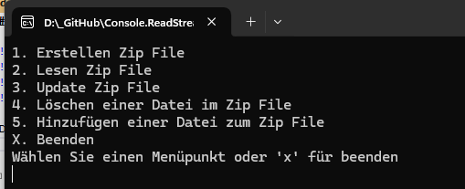

# Console.ReadStreamFromZip

]

Das Beispiel zeigt verschiedene Möglichkeiten im Umgang mit einem ZIP Archiv mit NET Core. 

 

Beispiele: 
- Erstellen eines ZIP Archiv
- Lesen eines ZIP Archiv
- Update eines ZIP Archiv
  Eine Datei Ändern ohne diese auszupacken
- Löschen einer Datei aus dem ZIP Archiv
- Hinzufügen einer neuen Datei zum ZIP Archive
